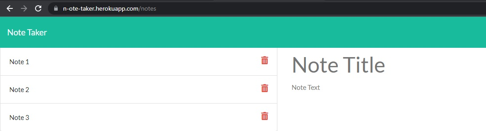
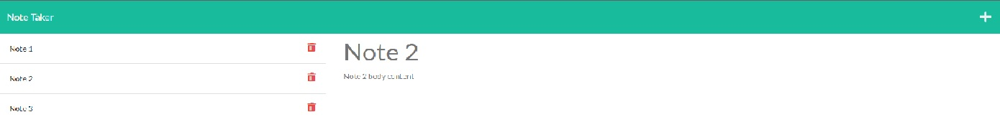
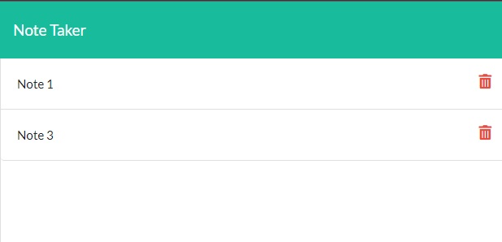

# Title
Nimature Eureka

# Description:
I was tasked with creating the backend of an app that would save the title and body of notes that a user entered.
This app should display notes saved in a left hand side column, if these saved notes are clicked on by the user both the
title and body of the note should appear in the main form... As a bonus I had to get the delete button to work.

# Usage:
Navigate your browser to the deployed application: 
https://n-ote-taker.herokuapp.com/
Click the get started button

Add a title and body content to the form and click the save icon, your note was saved to the list on the left of the screen

You can recall saved notes by clicking on the note in the left column

To add another note click on the + button on the header

Use the trash icon in the left column to delete a saved note from your history

# Contributions:
Patrick Sebstead

# Questions:
github username: RaiderNationBuilder

If you have any questions about this project you can reach me at the following email address: sebstead@yahoo.com

githuyb repo:  https://github.com/RaiderNationBuilder/nimature-eureka
heroku deployment:   https://n-ote-taker.herokuapp.com/